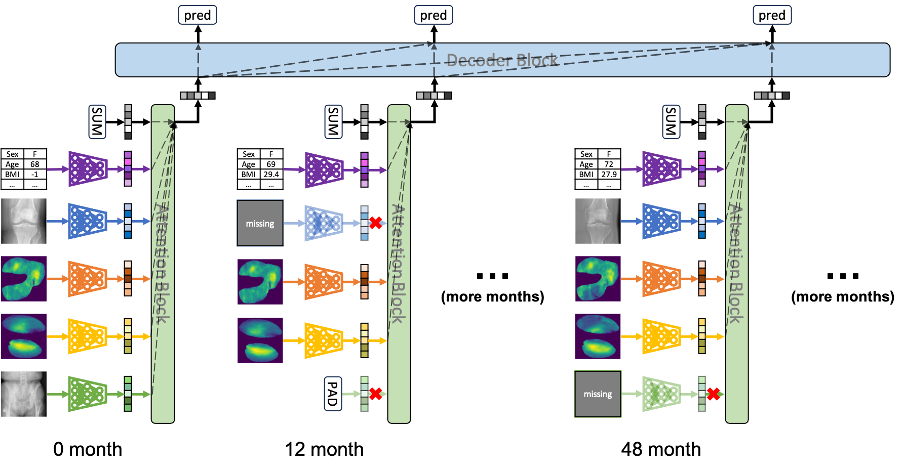
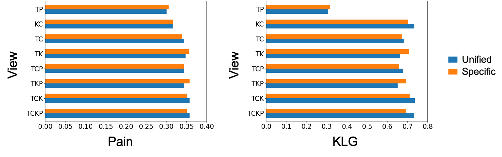
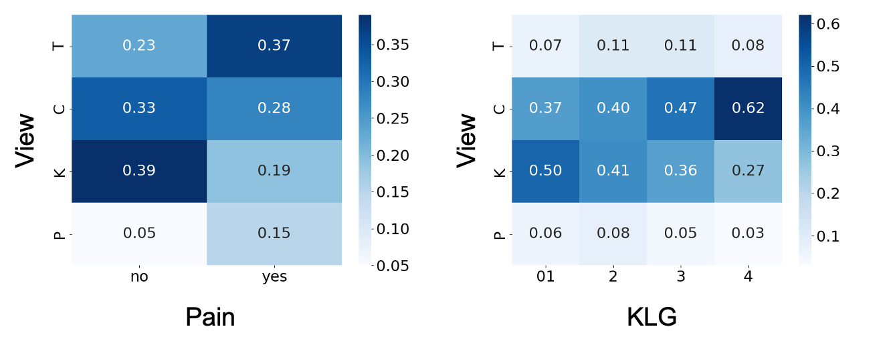

# A Unified Model for Longitudinal Multi-Modal Multi-View Prediction with Missingness

This repo includes the code for [A Unified Model for Longitudinal Multi-Modal Multi-View Prediction with Missingness](https://arxiv.org/pdf/2403.12211.pdf). 

Our model offers flexibility by accommodating various modalities, views, and timepoints, while adeptly handling missing data in the input. 
We evaluate our method on the [OAI dataset](https://nda.nih.gov/oai/) by predicting the WOMAC pain and KLG score 24 month ahead.

Our unified model is able to: 1) generalize to different combinations during evaluation; 2) show the benefit of incorporating longitudinal data; 3) easily probe and analyze the importance of different views for different prediction tasks.




### Installation
```
git clone https://github.com/uncbiag/UniLMMV.git
cd UniLMMV
conda env create -f environment.yml
conda activate UniLMMV
```

### Training
   ```
   python run.py --views <view1 view2 ...> --devices <0,1,...> --seeds <seed1, seed2, ...>
   ```  

### Evaluation
   ```
   python analysis.py --ex_num <0/1/2/3> --views <view1 view2 ...> --devices <0,1,...> --seeds <seed1, seed2, ...>
   ```

### Results
1. Average precision between our unifed model and view-specific model for different view combinations on WOMAC pain and KLG prediction:

    

2. Analysis of the view importance for each class on WOMAC pain and KLG prediction:

    

### Citation
If you find this project useful, please cite:

```
@article{chen2024unified,
  title={A Unified Model for Longitudinal Multi-Modal Multi-View Prediction with Missingness},
  author={Chen, Boqi and Oliva, Junier and Niethammer, Marc},
  journal={arXiv preprint arXiv:2403.12211},
  year={2024}
}
```


